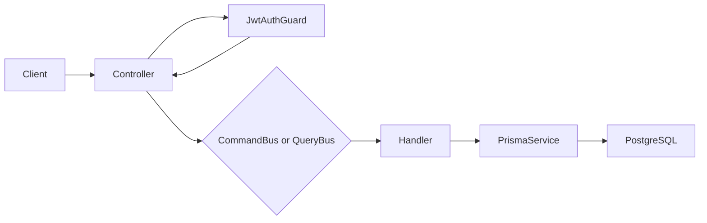

# API architecture

## Modules

- `AuthModule` verifies credentials, hashes passwords, issues JWTs, and exports
  `JwtAuthGuard` and its JWT configuration for protected modules.
- `UsersModule` owns user persistence. It exposes `UsersSecurityPort` as its
  security boundary for creating users and finding a user by email.
- `MeetingsModule` owns the meetings HTTP API and uses CQRS for all operations.
- `PrismaModule` owns the shared Prisma database client.

## CQRS in `MeetingsModule`

Controllers contain no application or database logic. They validate the HTTP
payload, authenticate the caller, then dispatch one message through Nest CQRS.



| HTTP operation      | CQRS message           | Handler                | Responsibility                                   |
| ------------------- | ---------------------- | ---------------------- | ------------------------------------------------ |
| `POST /meetings`    | `CreateMeetingCommand` | `CreateMeetingHandler` | Creates a meeting for the authenticated owner.   |
| `GET /meetings`     | `GetMeetingsQuery`     | `GetMeetingsHandler`   | Reads the current owner's meetings.              |
| `GET /meetings/:id` | `GetMeetingQuery`      | `GetMeetingHandler`    | Reads one current-owner meeting or raises `404`. |

Commands change state. Queries only read state. `meetingSelect` is the shared
read model selection; it ensures every meeting response excludes `ownerId`.

## Authentication and users boundary

`AuthModule` owns authentication decisions: it validates a registration attempt,
hashes and verifies passwords, handles duplicate and invalid-credential errors,
and issues JWTs. It does not access Prisma or the `User` model directly.

Instead, it depends on the `UsersSecurityPort` token exported by `UsersModule`.
The port offers only the credential-oriented operations authentication needs:
create a user and find one by email. `UsersModule` implements that contract with
`UsersService` and owns all Prisma queries. This security pattern keeps password
hashes within the module-to-module boundary while preventing authentication from
depending on the users persistence implementation.

The API exposes no controller for users: user creation and lookup are available
only through the security port. The HTTP surface is limited to the routes listed
in `docs/api.md`; the former unconsumed root health route is intentionally not
part of the application.

## Ownership and authorization

The JWT payload contains the user ID in `sub`. `JwtAuthGuard` verifies the
token and attaches that payload to the Nest request. The controller passes only
`sub` to the command or query. Query handlers filter by `ownerId`, so ownership
is enforced where data is accessed rather than relying on controller logic.

`GetMeetingHandler` deliberately returns the same `404` for a foreign and a
missing ID. This prevents a caller from discovering another user's meetings.

## Persistence and migrations

Prisma models live in `apps/api/prisma/schema.prisma`; SQL migrations are stored
in `apps/api/prisma/migrations` and must be committed with schema changes.

The meetings ownership migration preserves pre-existing meetings by leaving
their `owner_id` as `NULL`. They are intentionally excluded from authenticated
queries until an approved ownership-backfill process assigns them to users.

For schema work, run:

```bash
npm run prisma:generate --workspace @video-meetings/api
npm run prisma:migrate --workspace @video-meetings/api -- --name describe-your-change
```
