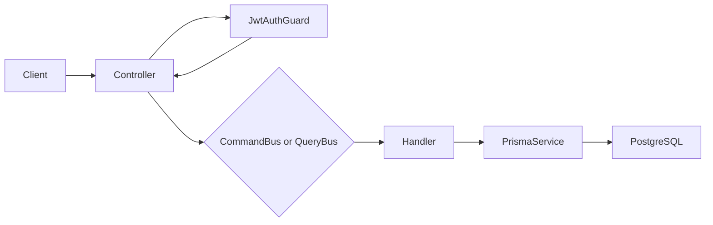

# API architecture

## Modules

- `AuthModule` verifies credentials, hashes passwords, issues JWTs, and exports
  `JwtAuthGuard` and its JWT configuration for protected modules.
- `UsersModule` owns user persistence. It exposes `UsersSecurityPort` as its
  security boundary for creating users and finding a user by email.
- `MeetingsModule` owns the meetings HTTP API and uses CQRS for all operations.
- `FilesModule` owns local meeting-file storage and its protected HTTP API.
- `PrismaModule` owns the shared Prisma database client.

## CQRS in `MeetingsModule`

Controllers contain no application or database logic. They validate the HTTP
payload, authenticate the caller, then dispatch one message through Nest CQRS.



| HTTP operation      | CQRS message           | Handler                | Responsibility                                 |
| ------------------- | ---------------------- | ---------------------- | ---------------------------------------------- |
| `POST /meetings`    | `CreateMeetingCommand` | `CreateMeetingHandler` | Creates a meeting for the authenticated owner. |
| `GET /meetings`     | `GetMeetingsQuery`     | `GetMeetingsHandler`   | Reads meetings available to the current user.  |
| `GET /meetings/:id` | `GetMeetingQuery`      | `GetMeetingHandler`    | Reads one available meeting or raises `404`.   |

Commands change state. Queries only read state. `meetingSelect` is the shared
read model selection; it ensures every meeting response excludes `ownerId`.

## Authentication and users boundary

`AuthModule` owns authentication decisions: it validates a registration attempt,
hashes and verifies passwords, handles duplicate and invalid-credential errors,
and issues JWTs. It does not access Prisma or the `User` model directly.

Instead, it depends on the `UsersSecurityPort` token exported by `UsersModule`.
The port offers only the credential-oriented operations authentication needs:
create a user and find one by email. `UsersModule` implements that contract with
`UsersService` and owns all Prisma queries. This security pattern keeps password
hashes within the module-to-module boundary while preventing authentication from
depending on the users persistence implementation.

The API exposes no controller for users: user creation and lookup are available
only through the security port. The HTTP surface is limited to the routes listed
in `docs/api.md`; the former unconsumed root health route is intentionally not
part of the application.

## Ownership and authorization

The JWT payload contains the user ID in `sub`. `JwtAuthGuard` verifies the token
and attaches that payload to the Nest request. The controller passes only `sub`
to the command or query. Collection and detail queries accept either the owner
or a `MeetingParticipant` and return a derived `accessRole` instead of exposing
`ownerId`. Authorization remains enforced where data is accessed rather than
relying on controller logic.

`GetMeetingHandler` deliberately returns the same `404` for an inaccessible and
a missing ID. This prevents a caller from discovering another user's meetings.

`FilesModule` extends that rule with `MeetingAccessService`, the single policy
for a meeting owner or a `MeetingParticipant`. Its guard runs after JWT
verification and before Nest's Multer interceptor, so an outsider gets the same
`404` before any upload bytes are retained. The service repeats the access check
before it commits a validated upload, covering a participant whose membership
was revoked during a long transfer.

## Meeting file storage

`FilesController` accepts exactly one multipart field (`file`) and delegates to
`MeetingFilesService`. Multer streams that field to `UPLOAD_TEMP_DIR`; the
service validates the approved extension/MIME/signature combination, generates a
256-bit storage key, atomically renames the temporary file to
`UPLOAD_DIR/<storageKey>/content`, then writes a `MeetingFile` metadata row.
If database creation fails, it removes the final file as compensation.

Before Multer starts, the upload capacity guard atomically reserves the complete
`Content-Length` in the single API process. The reservation is released on every
request completion path and prevents concurrent uploads from violating the
configured free-space reserve.

The filesystem implementation is isolated in `LocalMeetingFileStorageService`.
No database record stores an absolute path, and neither storage keys nor uploader
IDs are returned in the API representation. `MeetingFile` is associated with one
meeting and records its original display name, inferred category, verified MIME
type, byte size, status, and upload timestamp. Listing and download ticket
creation return only `READY` records.

Downloads use a two-step flow so a browser does not need to place its JWT in a
URL or buffer a potentially 1 GiB response. An authenticated owner or participant
creates a 256-bit, 60-second ticket. Only its SHA-256 hash is persisted. The
public download controller atomically marks the ticket used, rechecks the
issuing user's current access, and streams the local file with private,
non-sniffable attachment headers.

Deletion is restricted to the meeting owner. In a transaction, the service
atomically claims the file by changing it from `READY` to `DELETING`; it then
removes the storage directory and deletes the metadata row. Tickets cascade with
the metadata. A second concurrent delete cannot claim the same row.

Failed storage or database deletion leaves the hidden `DELETING` row and its
storage key. A single-process reconciliation service runs at application startup
and every minute, retrying rows whose `updatedAt` is at least one minute old so
it does not race an active request. If a download discovers missing local
content, the metadata moves to `MISSING` and is excluded from subsequent
list/download operations.

## Persistence and migrations

Prisma models live in `apps/api/prisma/schema.prisma`; SQL migrations are stored
in `apps/api/prisma/migrations` and must be committed with schema changes.

The meetings ownership migration preserves pre-existing meetings by leaving
their `owner_id` as `NULL`. They are intentionally excluded from authenticated
queries until an approved ownership-backfill process assigns them to users.

For schema work, run:

```bash
npm run prisma:generate --workspace @video-meetings/api
npm run prisma:migrate --workspace @video-meetings/api -- --name describe-your-change
```
