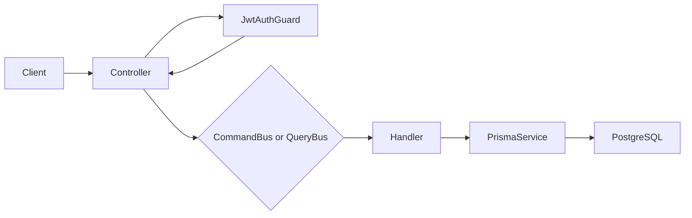

# API architecture

## Modules

- `AuthModule` verifies credentials, hashes passwords, issues JWTs, and exports
  `JwtAuthGuard` and its JWT configuration for protected modules.
- `UsersModule` owns credential-oriented user persistence. It exposes
  `UsersSecurityPort` as its security boundary for creating users and finding a
  user by email. It also owns
  `apps/api/src/users/models/user-identity.response.ts`, the single contract for
  the user fields shared activity may show to another user; every module that
  embeds a user in a response another user can read builds it from there, so
  widening that contract widens all of them at once.
- `ProfileModule` owns the protected current-user profile, avatar, and
  self-service password-change HTTP APIs. It owns private avatar storage
  separately from meeting files, and it is the only module that resolves an
  avatar object: it exports `UserAvatarService` so another module can stream a
  user's avatar bytes after enforcing its own access rule, without learning the
  storage key or reading any other profile field.
- `MeetingsModule` owns the meetings HTTP API and uses CQRS for all operations.
- `FilesModule` owns local meeting-file storage and its protected HTTP API. It
  imports `ProfileModule` for the exported `UserAvatarService`; this is the only
  place where avatar bytes cross a module boundary, and they do so behind the
  meeting's own access rule.
- `PrismaModule` owns the shared Prisma database client.
- `ClaudeAgentModule` sends a single prompt to Claude through the Claude Agent
  SDK and exports `ClaudeAgentService`. It authenticates with `ANTHROPIC_API_KEY`
  from `apps/api/.env`, runs on `claude-haiku-4-5`, and starts the child agent
  with no built-in tools, no settings from disk, and one turn. The child inherits
  an explicit list of variables rather than `process.env`, and keeps its own
  configuration under `apps/api/var/claude-agent`, so it cannot fall back to the
  Claude Code login of whoever runs the suite — without that it authenticated as
  the developer and the test passed with any key at all. `MeetingSummaryModule`
  now imports it — see "Meeting summary processing" below — and
  `test/claude-agent.e2e-spec.ts` still exercises it directly. That suite calls
  the real Anthropic API, so it bills the account; it skips itself when no key
  is configured.
- `MeetingSummaryModule` owns the meeting summary HTTP API and runs its job
  in-process inside the API, with no separate worker; see "Meeting summary
  processing" below.

## CQRS in `MeetingsModule`

Controllers contain no application or database logic. They validate the HTTP
payload, authenticate the caller, then dispatch one message through Nest CQRS.


```mermaid
flowchart LR
  Client --> Controller
  Controller --> Guard["JwtAuthGuard"]
  Guard --> Controller
  Controller --> Bus{"CommandBus or QueryBus"}
  Bus --> Handler
  Handler --> PrismaService
  PrismaService --> PostgreSQL
```

| HTTP operation      | CQRS message           | Handler                | Responsibility                                 |
| ------------------- | ---------------------- | ---------------------- | ---------------------------------------------- |
| `POST /meetings`    | `CreateMeetingCommand` | `CreateMeetingHandler` | Creates a meeting for the authenticated owner. |
| `GET /meetings`     | `GetMeetingsQuery`     | `GetMeetingsHandler`   | Reads meetings available to the current user.  |
| `GET /meetings/:id` | `GetMeetingQuery`      | `GetMeetingHandler`    | Reads one available meeting or raises `404`.   |

Commands change state. Queries only read state. `meetingSelect` is the shared
read model selection; it ensures every meeting response excludes `ownerId`.

## Authentication and users boundary

`AuthModule` owns authentication decisions: it validates a registration attempt,
hashes and verifies passwords, handles duplicate and invalid-credential errors,
and issues JWTs. It also owns the minimal persisted authentication-session state
used to revoke JWTs: one row per issued token, so a password change can revoke
all of a user's tokens at once.

Instead, it depends on the `UsersSecurityPort` token exported by `UsersModule`.
The port offers only the credential-oriented operations authentication needs:
create a user, find one by email, and run a callback with credentials serialized
by user. The serialization operation obtains the same per-user transaction lock
used by password changes, then re-reads the credentials before the callback
verifies the password and creates the authentication session in that transaction.
`UsersModule` implements that contract with `UsersService`. It owns the Prisma
queries that return credential material, including password hashes. This security
pattern keeps hashes inside the module-to-module boundary while preventing
authentication from depending on the `User` persistence model.

`ProfileModule` is deliberately outside `UsersSecurityPort`: its profile reads,
updates, and avatar operations are not credential operations. Its one credential
boundary is the authenticated `POST /users/me/password` operation: it accepts
only the verified JWT subject and session ID, selects that subject's password
hash inside its transaction, verifies the current password, atomically replaces
the hash, and revokes every authentication session of that subject, including
the caller's. It never returns or logs a password or hash, has no operation
accepting a target user ID or an email update, and rate limits password
verification by both caller account and client IP. Other profile operations use
`PrismaModule` only for safe fields (`id`, `email`, `displayName`, and private
avatar metadata). Thus the credential flow in `AuthModule` has no direct `User`
model dependency, `AuthSessionService` is its only Prisma-backed authentication
state, `UsersModule` does not expose general user CRUD, and the profile HTTP
surface is limited to the authenticated caller endpoints documented in
`docs/api.md`.

There is no general users controller: user creation and credential lookup are
available only through the security port, while the profile controller exposes
only the authenticated caller's safe profile. The former unconsumed root health
route is intentionally not part of the application.

## Avatar storage

`ProfileController` accepts one authenticated multipart `avatar` upload only
for the JWT subject. It writes the candidate to `AVATAR_TEMP_DIR`, then
`AvatarValidationService` uses the image decoder to verify that JPEG, PNG, or
WebP content can be decoded and matches the supplied extension and MIME type.
Only then does `LocalAvatarStorageService` atomically move it to the separate
private `AVATAR_DIR/<storageKey>/content` object store and the profile service
writes its metadata to the user row. Failed validation and failed persistence
discard the candidate or final object. Startup removes only `.part` files older
than the configured safety window, so a second API instance cannot remove an
active upload on a shared storage volume. `AvatarListVariantService`, also owned
by `ProfileModule`, then derives a list-sized picture from the bytes validation
already read and stores it beside the original as
`AVATAR_DIR/<storageKey>/list-96`, publishing it through a `.part` file in
`AVATAR_TEMP_DIR` like every other write; an empty `list-96` records the
decision that the original is what a list should receive — it is within the box
and the byte budget, or re-encoding it pays nothing — so it is never copied
twice. That marker is written only for a decision: a derivation that threw
leaves nothing behind, so a transient decode failure does not pin the avatar to
full-size delivery. Deriving at upload keeps reads a plain file open, and
keeping the derived file under the avatar's own storage key means replacement,
removal and reconciliation drop it with the avatar it belongs to.

Retrieval has two routes, both streaming a verified object with private,
non-sniffable headers. `GET /users/me/avatar` streams the requesting user's own
original: the profile screen is not a list context.
`GET /meetings/:meetingId/uploaders/:handle/avatar`, owned by `FilesModule`,
streams the avatar of an identity that uploaded a meeting file:
`MeetingUploaderAvatarService` first requires the caller's access to the
meeting, then matches the handle against the uploaders of its ready files and
delegates to the exported `UserAvatarService`, which opens the object but
decides nothing about who may read it. That route asks for the list variant,
because it paints a row rather than a profile picture. An avatar is therefore
reachable only through a meeting the caller owns or takes part in, never through
a user identifier, and the rest of that uploader's profile stays private. The
service resolves the avatar's version before opening it, so the controller
answers a revalidated request with `304` and no file access; the version is the
stored avatar's own, so a client revalidating asks about the picture rather than
the size it was served in. Neither the profile response nor the HTTP API exposes
storage keys.
Avatar removal clears the user-row metadata atomically before private-object
cleanup. A transient cleanup failure leaves the user in the stable
avatar-absent state and is reconciled by the storage service without exposing
the object's internal path.

Another user reads an avatar only through shared activity, never by user ID:
`GET /meetings/:meetingId/files/:fileId/uploader-avatar` streams it under the
containing meeting's own authorization. That route is a list context and so
deliberately answers with the derived `list-96` picture rather than the bytes
`GET /users/me/avatar` returns, falling back to the original only when it was
never derived and cannot be. So that a client can tell that many rows
name one picture and read it once, the identity in a shared response carries an
opaque `avatar.key` where the user ID would otherwise be: a MAC of the uploader's
ID, scoped to the meeting, keyed on material derived from the configured
`JWT_SECRET` under a distinct label. Deriving it from configuration rather than a
per-process random value keeps every instance behind a load balancer, and the
same instance after a restart, agreeing on the key, so a response from one
instance does not invalidate a cache filled by another. `userIdentitySelect`
stays the allowlist of fields a shared response may expose; the user ID is read
through the separate `userIdentityReadSelect` and is never emitted. Failures on
that route are split for the same reason the key exists: a file that is gone
answers `404 FILE_NOT_FOUND`, which is scoped to the one route and lets a client
read the uploader's avatar through another of their files, while every other
failure answers identically for all of them and must end the read at one
request, not one per row.

## Ownership and authorization

The JWT payload contains the user ID in `sub` and, for newly issued tokens, a
unique authentication-session ID in `sid`. When registration or login issues a
JWT, `AuthSessionService` first creates an `auth_sessions` row for that user;
`sid` identifies that row. The guard verifies a non-empty `sid` against a row
belonging to `sub` with no `revoked_at` value. Revoking a row therefore
invalidates its bearer token and nothing else. A password change revokes every
row of that user, which is the only bulk termination the API offers: there is no
session-management screen and no password reset, so the change is a user's sole
way to evict a token they no longer hold.

`sid` was added after JWTs had already been issued. During the rollout,
`ACCEPT_LEGACY_JWT_WITHOUT_SESSION=true` temporarily admits signed legacy tokens
that lack it, avoiding a global logout. Such a token cannot change a password,
because it has no session row to revoke. After at least the one-hour maximum JWT
lifetime, deployments set the flag to `false`; missing, malformed, unknown, or
revoked session identities are then rejected as `401` and every protected token
is revocable.

Only token verification is treated as an authentication failure: if the session
lookup itself fails, the error propagates as `5xx` instead of `401`. A `401`
makes every browser clear its session and return to sign-in, so a database blip
would otherwise sign all active users out.

After this verification, the guard attaches the payload to the Nest request.
The controller passes only `sub` to the command or query. Collection and detail
queries accept either the owner or a `MeetingParticipant` and return a derived
`accessRole` instead of exposing `ownerId`. Authorization remains enforced where
data is accessed rather than relying on controller logic.

`GetMeetingHandler` deliberately returns the same `404` for an inaccessible and
a missing ID. This prevents a caller from discovering another user's meetings.

`FilesModule` extends that rule with `MeetingAccessService`, the single policy
for a meeting owner or a `MeetingParticipant`. Its guard runs after JWT
verification and before Nest's Multer interceptor, so an outsider gets the same
`404` before any upload bytes are retained. The service repeats the access check
before it commits a validated upload, covering a participant whose membership
was revoked during a long transfer. `MeetingSummaryModule` reuses the same
`MeetingAccessService` rather than adding a second access policy.

## Meeting file storage

`FilesController` accepts exactly one multipart field (`file`) and delegates to
`MeetingFilesService`. Multer streams that field to `UPLOAD_TEMP_DIR`; the
service validates the approved extension/MIME/signature combination, generates a
256-bit storage key, atomically renames the temporary file to
`UPLOAD_DIR/<storageKey>/content`, then writes a `MeetingFile` metadata row.
If database creation fails, it removes the final file as compensation.

Before Multer starts, the upload capacity guard atomically reserves the complete
`Content-Length` in the single API process. The reservation is released on every
request completion path and prevents concurrent uploads from violating the
configured free-space reserve.

The filesystem implementation is isolated in `LocalMeetingFileStorageService`.
No database record stores an absolute path, and neither storage keys nor user
IDs are returned in the API representation. `MeetingFile` is associated with one
meeting and records its original display name, inferred category, verified MIME
type, byte size, status, and upload timestamp. Its representation also carries
`uploadedBy`, the uploader's safe identity built by the shared
`apps/api/src/users/models/user-identity.response.ts` contract: an opaque
handle, a display name and, when the user has an avatar, the timestamp of its
current version. It is read from the user record on every response and is
`null` when the uploading account no longer exists.

The handle is `HMAC-SHA256(key, length-prefixed scope + user ID)` truncated to
128 bits, under a key derived from the JWT secret so a handle can never be
confused with a token. The scope is the meeting ID, which makes the value stable
for one uploader inside one meeting — the property that lets a client collapse
many files onto a single avatar URL — and scopes authorization: a handle is
accepted only by the meeting it was minted for, and the user ID cannot be
recovered from it. This is an authorization boundary, not anonymity: the
`uploadedBy` fields around the handle — the display name and the avatar
version timestamp that also drives the avatar route's `ETag` — are
deliberately the same values in every meeting, so a caller who is in two
meetings can still tell that the same person uploaded in both.

Listing and download ticket creation return only `READY` records.

Downloads use a two-step flow so a browser does not need to place its JWT in a
URL or buffer a potentially 1 GiB response. An authenticated owner or participant
creates a 256-bit, 60-second ticket. Only its SHA-256 hash is persisted. The
public download controller atomically marks the ticket used, rechecks the
issuing user's current access, and streams the local file with private,
non-sniffable attachment headers.

Deletion is restricted to the meeting owner. In a transaction, the service
atomically claims the file by changing it from `READY` to `DELETING`; it then
removes the storage directory and deletes the metadata row. Tickets cascade with
the metadata. A second concurrent delete cannot claim the same row.

Failed storage or database deletion leaves the hidden `DELETING` row and its
storage key. A single-process reconciliation service runs at application startup
and every minute, retrying rows whose `updatedAt` is at least one minute old so
it does not race an active request. If a download discovers missing local
content, the metadata moves to `MISSING` and is excluded from subsequent
list/download operations.

## Transcription worker

`TranscriptionWorkerModule` is assembled by a separate process
(`apps/api/src/transcription/worker/main.ts`), not by `AppModule`: the HTTP
process would then hold the GPU and block on a recording hours long, which is
the one thing a separate worker exists to prevent.

Uploading an audio or video file creates its `TranscriptionJob` row nested
inside the same `create` call as the `MeetingFile` row, in status `QUEUED`; a
document or an already-uploaded transcript never gets one.

The worker polls every `TRANSCRIPTION_POLL_INTERVAL_MS` and processes one job
at a time — the queue is drained sequentially because the GPU fits one
recognition run. `claimNextJob` finds the oldest `QUEUED` job whose source
file is still `READY`, then claims it with an `updateMany` guarded by
`status: QUEUED`: two workers reading the same candidate produce one update
with `count === 1` and one with `count === 0`, so exactly one worker wins. The
winning update moves the job to `PROCESSING`, sets `leaseOwner` to an
identifier unique to this worker process (`hostname:pid:uuid`) and
`leaseExpiresAt` to now plus `TRANSCRIPTION_LEASE_TIMEOUT_MS`, and increments
`attemptCount`.

The worker then converts the recording to 16 kHz mono WAV, runs the
configured recognizer, and writes the result as a new `MeetingFile` in
category `TRANSCRIPT`. `completeJob` records that file and closes the job to
`COMPLETED` in one transaction, but only when the job is still `PROCESSING`
under this worker's own `leaseOwner` and the source file is still `READY`;
otherwise it returns false and the caller discards the transcript bytes
instead of leaving a transcript with no matching recording. Any failure
instead calls `failJob`, which closes the job to `FAILED` with one of the
failure codes documented in `docs/api.md`, again guarded by
`status: PROCESSING` and this worker's `leaseOwner`.

`leaseOwner` and `leaseExpiresAt` record which worker process holds a
`PROCESSING` job and until when, so a second worker instance never claims a
job the first is already running. In this phase that is all they do: nothing
sweeps a lease whose `leaseExpiresAt` has passed and returns the job to
`QUEUED`. A worker asked to stop finishes the job in flight first, but one that
is killed or crashes mid-job leaves its job `PROCESSING` under an expired lease
that no process retries; the recording stays without a transcript until it is
uploaded again. That is a deliberate scope cut for this
phase, not a gap — automatic lease reclaim is future work.

## Meeting summary processing

`MeetingSummaryModule` runs entirely inside the API process; there is no
separate worker the way there is for transcription. A summary job is one
bounded model call, seconds to a few minutes against `SUMMARY_TIMEOUT_MS`, not
the hours-long recognition run the transcription worker exists to keep off the
HTTP process, so holding it in-process costs nothing the way holding a GPU
recognition job would.

`POST /meetings/:meetingId/summary` upserts the meeting's single
`MeetingSummary` row — unique on `meetingId`, so a meeting has at most one — to
`QUEUED`, clearing any previous result, and calls
`MeetingSummaryRunnerService.process` without awaiting it. The HTTP response
returns as soon as the row is written; the model call happens after.

`MeetingSummarySchedulerService` is the automatic counterpart to that route:
it runs once at application startup and every `SUMMARY_SCHEDULER_INTERVAL_MS`
afterward, guarded by the same single-process, running-flag pattern as the
file-deletion reconciler. Each pass unions two candidate queries, then drops
any meeting from either that still has a `TranscriptionJob` in `QUEUED` or
`PROCESSING`, or that `LocalMeetingFileStorageService.hasActiveUpload` reports
as currently mid-upload, so neither a recording still being recognized nor a
file still being received can trigger a summary of a transcript set that is
not final yet:

- Up to twenty meetings whose `TRANSCRIPT` files include one `READY` and
  whose `MeetingSummary` relation is still `null` — the same
  `meeting: { summary: null }` filter Prisma resolves against the unique
  `meetingId`. This is the first-run path.
- Meetings whose summary is `COMPLETED` or `FAILED` but whose stored
  `transcriptFingerprint` no longer matches
  `computeTranscriptFingerprint` of the meeting's current `READY`
  `TRANSCRIPT` file ids (`meeting-summary/transcript-fingerprint.ts`; a plain
  sorted, joined, SHA-256 hash — a transcript file is written once and never
  edited in place, so its id already stands for its content, and the hash
  only needs to notice the set changing). This is the recompute path: a new
  transcript, or any other change to the ready set, moves the fingerprint,
  while an unchanged set — including one behind a summary that simply
  failed — does not, which is what keeps a `FAILED` run from retrying itself
  every pass. Every finished summary is compared and the batch of twenty is
  taken from what the comparison leaves, least recently updated first —
  capping the query instead would cap what the pass can see rather than what
  it takes on, and a page of up-to-date rows would hide every stale meeting
  behind it.

`MeetingSummaryService.startForMeeting` queues whatever the union leaves
after the recognition-job filter, for either path alike: it always attempts
`create` first, and only a `P2002` unique-constraint failure — a row already
existing, whether from a first run or an earlier finished one — falls
through to `resetForRecompute`. That method re-reads the row inside a
transaction and re-checks both its status and the fingerprint itself before
touching it, so a row this pass's own candidate read is a moment stale about
— already claimed by a manual start, moved on by another scheduler pass, or
no longer actually stale — is left alone rather than reset out from under
whatever is already happening to it. A reset that does proceed clears the
row the same way a manual rerun does: status back to `QUEUED`, the new
fingerprint stamped in, previous `summaryText`/`failureCode`/timestamps
cleared, previous tasks and decisions deleted.

`start` and `startForMeeting` differ in how they hand their claimed row to
`MeetingSummaryRunnerService.process`, and deliberately so. `start` calls the
private `launch`, which fires `process` without awaiting it: the manual
route's HTTP response must return before the model call finishes.
`startForMeeting` has no HTTP response to protect, so it `await`s `process`
directly (through the same failure-logging wrapper `launch` uses internally)
— which is what keeps the scheduler's own loop in `run` from starting a
second real, billed model call before the first one it queued has finished.
Several such calls in flight at once was never a case the manual,
one-click-at-a-time route had reason to consider; the scheduler can find more
than one eligible meeting in a single pass, so it does.

`onApplicationBootstrap` itself only runs when `SUMMARY_SCHEDULER_AUTOSTART`
is `true` — the default everywhere except `apps/api/test/setup.ts`, which
turns it off for the whole e2e suite. Every e2e spec file boots its own full
`AppModule`, and none of them clean up their meeting-file fixtures
afterward; left on, the scheduler's boot-time pass in a later, unrelated spec
file's app instance would auto-summarize whatever ready `TRANSCRIPT` an
earlier spec left behind — a real, billed model call against data that spec
never intended to reach Claude. `meeting-summary.e2e-spec.ts` is the one spec
that wants scheduler behavior, and it drives `run()` on the service directly
instead of relying on auto-start. A rejection from that first pass is caught
the same way a later interval tick's is, so a single bad pass fails neither
that spec's own app boot nor, in the non-test default, the real
application's startup.

`process` first claims the job with an `updateMany` guarded by
`status: QUEUED`, the same defensive pattern the transcription worker uses to
claim a job: the update reports how many rows it touched, and a caller that
claims zero returns immediately instead of processing a row it does not
actually own. The claimed run then reads every `TRANSCRIPT` file's text for
the meeting, rejects it with `INPUT_TOO_LARGE` past `SUMMARY_MAX_INPUT_CHARS`,
and calls `ClaudeAgentService.ask` with `SUMMARY_TIMEOUT_MS` as its timeout,
`SUMMARY_MAX_AGENT_TURNS` as its turn budget, and the three tools
`MeetingToolsService.createServer` builds — `find_similar_tasks`,
`upsert_task`, `write_summary_and_decisions` — as an in-process MCP server
named `meeting`, the only tools the model may call (`allowedTools` lists their
fully-qualified `mcp__meeting__*` names; `ClaudeAgentService.ask` still
hardcodes `tools: []`, so no built-in tool is ever reachable regardless of
what a caller passes). `ClaudeAgentModule`, written earlier but until now
imported nowhere, is wired into `AppModule` through `MeetingSummaryModule`'s
own imports.

`buildMeetingHooks` (`meeting-summary/hooks.ts`) adds a hook layer on top of
those three tools, built once per run and reused across every retry so its
tool-call budget is a total for the whole run: a `PreToolUse` hook denies an
`upsert_task` call whose title is missing or under three characters, another
`PreToolUse` hook denies any call once the run passes `SUMMARY_MAX_TOOL_CALLS`,
and a `PostToolUse` hook writes every tool call and its result to the Nest
logger as an audit trail.

The prompt instructs the model to call `find_similar_tasks` before recording
each task and, when a similar one is already there, call `upsert_task` with
its id instead of creating a new row — this is how a task mentioned again in
another transcript file, or restated later in the same one, becomes one row
instead of a duplicate. Each tool call writes straight through `PrismaService`
as the conversation runs; `write_summary_and_decisions`, called once at the
end, writes the summary text and replaces the run's decisions the same way a
rerun replaces them (delete then recreate). The model's final reply is still
the same JSON object as before — `{summary, tasks, decisions}` — but it is now
a completion check, not the write path: a reply that fails to parse, lacks
any of these three fields, or has a malformed task or decision fails the job
with `MODEL_OUTPUT_INVALID`, even though the tool calls up to that point
already persisted whatever they wrote — nothing currently rolls a partial
write back on a late failure.

A rerun goes through the same upsert: the existing row's status,
`summaryText`, `failureCode`, `startedAt`, and `finishedAt` are all
overwritten in place rather than a new row being created, which is what makes
a new run replace the previous result outright — there is no history to keep
or roll back.

The transcription worker documented above leaves a job `PROCESSING` forever
after an unclean exit, because a second worker process might still resume it.
Nothing analogous can happen here: only the API process itself ever moves a
`MeetingSummary` row into `PROCESSING`, so a row still in that state after a
restart can only mean the previous process died mid-job.
`MeetingSummaryReconciliationService` runs once at application startup and
moves every such row to `FAILED` with `failureCode: INTERRUPTED`.

## Persistence and migrations

Prisma models live in `apps/api/prisma/schema.prisma`; SQL migrations are stored
in `apps/api/prisma/migrations` and must be committed with schema changes.

The meetings ownership migration preserves pre-existing meetings by leaving
their `owner_id` as `NULL`. They are intentionally excluded from authenticated
queries until an approved ownership-backfill process assigns them to users.

For schema work, run:

```bash
npm run prisma:generate --workspace @video-meetings/api
npm run prisma:migrate --workspace @video-meetings/api -- --name describe-your-change
```
